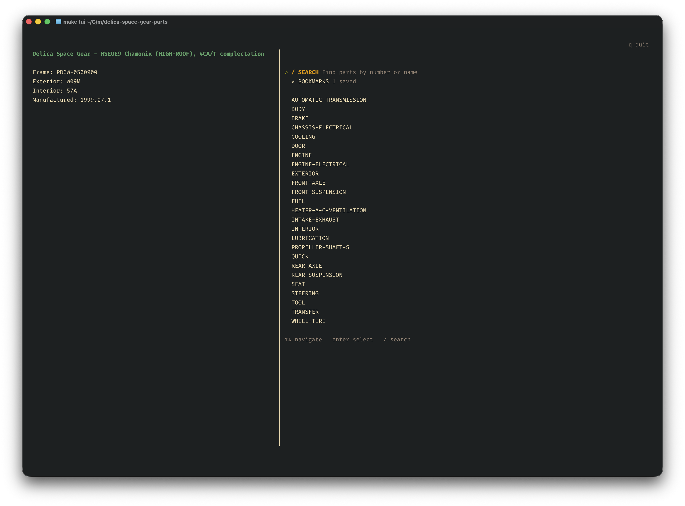

# Delica Parts

A tool for scraping and browsing parts data from the Mitsubishi Delica Electronic Parts Catalog (EPC). Includes a web scraper to download parts data and a terminal user interface (TUI) for browsing.

## Screenshots

### Initial Screen



### Part Details Screen


## Prerequisites

- [Deno](https://deno.land/) (v1.40+) (`brew install deno` on macOS)
- [Ghostty](https://ghostty.org) (or any terminal that supports [kitty](https://sw.kovidgoyal.net/kitty/graphics-protocol/)) (`brew install ghostty` on macOS)

### For Development

- [Go](https://golang.org/) (v1.21+) (`brew install go` on macOS)

## Quick Start

```bash
# 1. Configure your vehicle
./scripts/bootstrap

# 2. Scrape parts data (takes a while)
./scripts/scrape

# 3. Browse parts
./scripts/start
```

## Dev Commands

| Command               | Description                                              |
| --------------------- | -------------------------------------------------------- |
| `make bootstrap` | Configure vehicle frame number and fetch vehicle details |
| `make scrape`    | Start or resume scraping parts data from the EPC         |
| `make status`    | Show scraping progress and statistics                    |
| `make start`     | Launch the terminal user interface                       |
| `make migrate` | Run database migrations |
| `make build` | Build the TUI binary |
| `make clean` | Remove build artifacts and data |

## Configuration

Vehicle configuration is stored in `.env`:

```
FRAME_NO='PD6W-0500900'
VEHICLE_NAME='HSEUE9 Chamonix (HIGH-ROOF), 4CA/T complectation'
FRAME_NAME='pd6w'
TRIM_CODE='hseue9'
EXTERIOR_CODE='W09M'
INTERIOR_CODE='57A'
MANUFACTURE_DATE='1999.07.3'
```

Run `./scripts/bootstrap` to set up this file. It will prompt for your frame number if not already configured.

## App Navigation

| Key | Action |
|-----|--------|
| `↑`/`↓` or `j`/`k` | Navigate menus |
| `Enter` | Select item |
| `Esc` | Go back |
| `/` | Search |
| `b` | Toggle bookmark |
| `q` | Quit |

### Screens

- **Home** - Vehicle info and parts groups
- **Group** - Subgroups within a category
- **Subgroup** - Parts diagram and parts list
- **Part Detail** - Part info, subgroup navigation, and external links
- **Search** - Full-text search across all parts
- **Bookmarks** - Saved parts for quick access

## Project Structure

```
├── scraper/              # Deno scraper
│   ├── src/             # Source code
│   │   ├── main.ts      # CLI entry point
│   │   ├── types.ts     # Type definitions
│   │   ├── db/          # Database operations
│   │   └── scraper/     # Web scraping logic
│   ├── scripts/         # Utility scripts
│   └── deno.json        # Deno configuration
├── tui/                  # Go TUI
│   ├── main.go          # TUI entry point
│   ├── model/           # Screen models
│   ├── ui/              # UI components
│   └── db/              # Database queries
├── data/                # SQLite database and images (gitignored)
├── .env                 # Vehicle configuration (gitignored)
└── Makefile             # Build commands
```

## Data

Parts data is stored in a SQLite database at `data/delica.db`. The schema includes:

- **groups** - Top-level categories (Engine, Transmission, etc.)
- **subgroups** - Subcategories with parts diagrams
- **diagrams** - Parts diagrams with images
- **parts** - Individual parts with numbers, descriptions, specs
- **bookmarks** - User-saved parts

Full-text search is available via the `parts_fts` virtual table.

## License

MIT

.